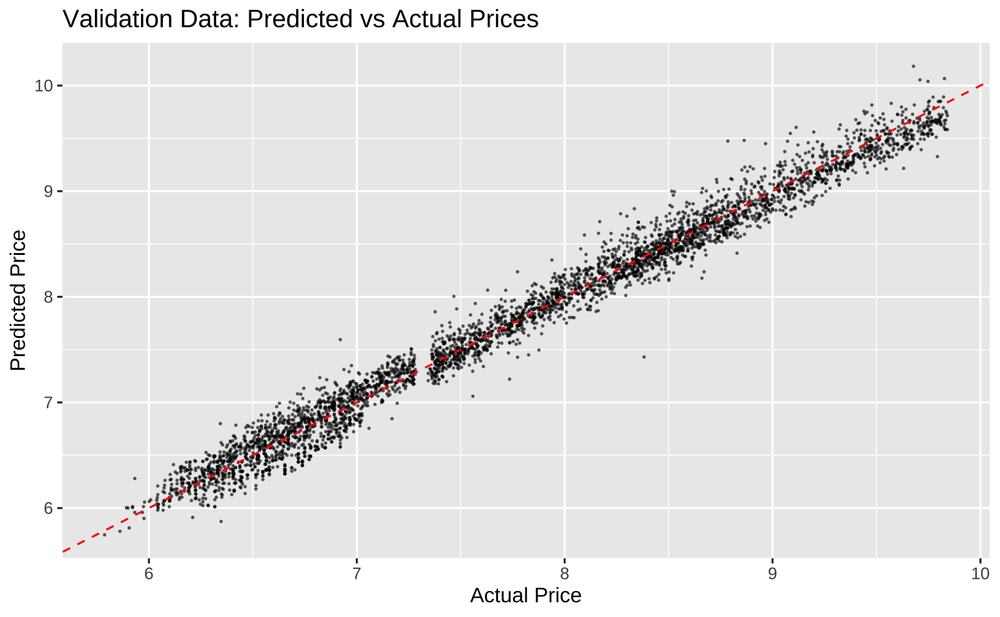
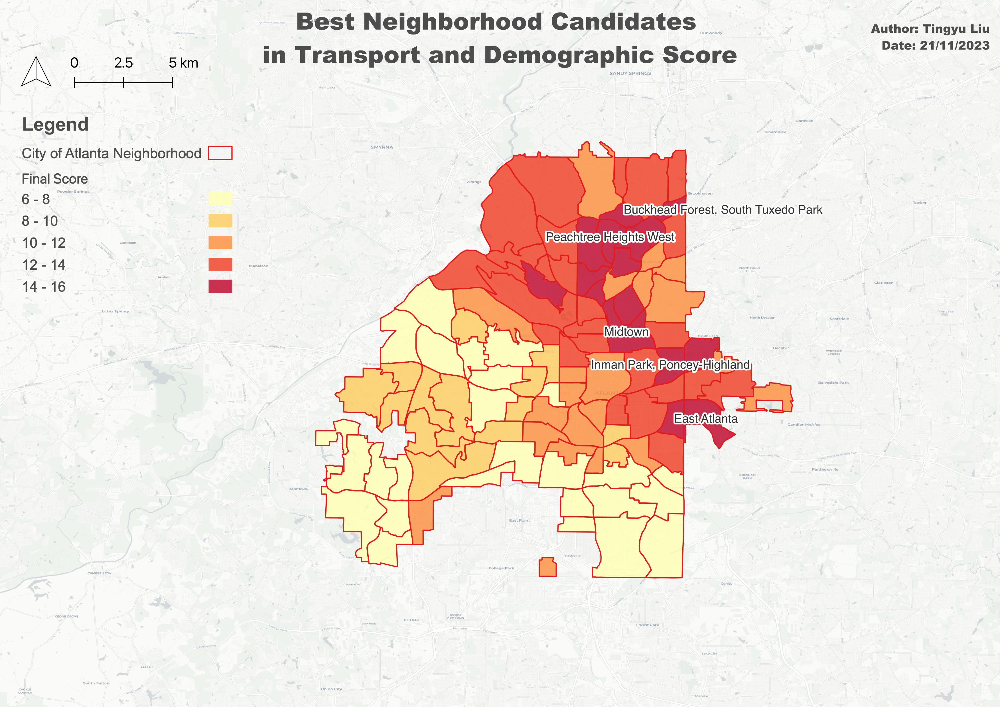

## Portfolio

---

### NLP | Data Science 

[Gemstone Price Prediction](/pdf/RegressionforJewelPrice.pdf)

---

[Music Venue Optimization in Atlanta](/pdf/TingyuLiu-project.pdf)

---
[Aggressive or Polite?](https://rpubs.com/drunken-boat/major4-final-2)
Social Media and Sentiment Analysis with Reddit Threads on Metal Music

---
[Project 1 Title](/sample_page)

---

### GIS | Spatial Data Analysis

[Fatal Encounter](https://github.com/drunken-boat/fatal-encounter-viz)

[Project 2 Title](http://example.com/)
- [Project 3 Title](http://example.com/)
- [Project 4 Title](http://example.com/)
- [Project 5 Title](http://example.com/)

---

---

Page template forked from <a href="https://github.com/evanca/quick-portfolio">evanca</a>

<!-- Remove above link if you don't want to attibute -->
